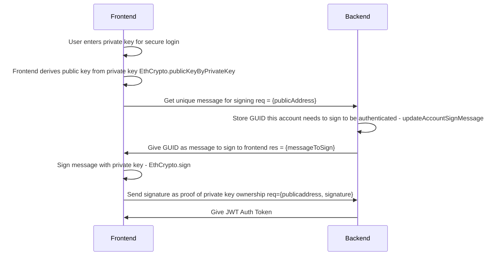
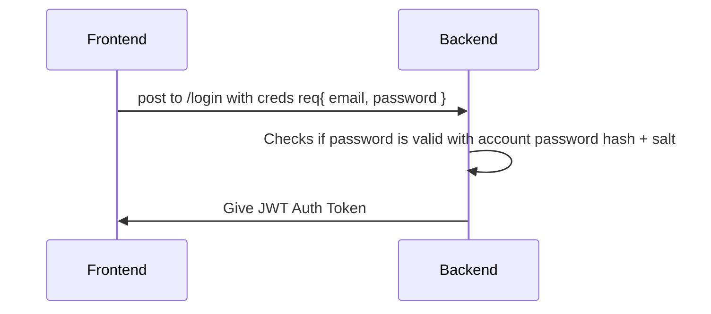

# MyPass

==============

The MyPass application is secure document storage solution designed to help people experiencing homelessness to store and share their important documents, such as IDs and medical forms. The hope of this product is to make signing up for services and housing easier for people experiencing homelessness, by reducing the delays caused by lost or damaged documents.

## Getting Started

### First launch the backend server

Change the env.template to be a .env file and update to your values

```bash
$ cp env.template .env
```

Install dependencies:

```bash
$ yarn
```

Start the server:

```bash
$ yarn start
```

Hit the api endpoints at: http://localhost:5000/api/

## One Click Heroku Deployment

Alternativly you can deploy the backend to heroku with one click:


[Deploy to Heroku](https://www.heroku.com/deploy/?template=https://github.com/cityofaustin/mypass/tree/main)

### Next Launch the React Frontend

The Frontend for this project can be found at: https://github.com/cityofaustin/mypass-frontend

## Project Info

This project is funded by the Robert Wood Johnson Foundation and developed by the Innovation Office at the City of Austin. Kerry O'Connor is the lead investigator, and Daniel Culotta is the Co-investigator on this project. This project is a prototype to test the design considerations around serving a displaced population, and the technology considerations around permanent document management, distributed ledger technology, and the conference of e-notarization.

The project timeline can be found here: [Timeline](https://docs.google.com/spreadsheets/d/1kMICJU_4RQoiki9yyuenM59W-u7ECp5vaF7qTbelfvQ/edit?usp=sharing)

## MyPass Features


See the README.md files for respective notes in the server and webclient folders.

## Authentication Flows

### Helper with private key



[![](https://mermaid.ink/img/eyJjb2RlIjoiXG5zZXF1ZW5jZURpYWdyYW1cbkZyb250ZW5kIC0-PiBGcm9udGVuZDogVXNlciBlbnRlcnMgcHJpdmF0ZSBrZXkgZm9yIHNlY3VyZSBsb2dpblxuRnJvbnRlbmQgLT4-IEZyb250ZW5kOiBGcm9udGVuZCBkZXJpdmVzIHB1YmxpYyBrZXkgZnJvbSBwcml2YXRlIGtleSBFdGhDcnlwdG8ucHVibGljS2V5QnlQcml2YXRlS2V5XG5Gcm9udGVuZCAtPj4gQmFja2VuZDogR2V0IHVuaXF1ZSBtZXNzYWdlIGZvciBzaWduaW5nIHJlcSA9IHtwdWJsaWNBZGRyZXNzfVxuQmFja2VuZCAtPj4gQmFja2VuZCA6IFN0b3JlIEdVSUQgdGhpcyBhY2NvdW50IG5lZWRzIHRvIHNpZ24gdG8gYmUgYXV0aGVudGljYXRlZCAtIHVwZGF0ZUFjY291bnRTaWduTWVzc2FnZVxuQmFja2VuZC0-PiBGcm9udGVuZDogR2l2ZSBHVUlEIGFzIG1lc3NhZ2UgdG8gc2lnbiB0byBmcm9udGVuZCByZXMgPSB7bWVzc2FnZVRvU2lnbn1cbkZyb250ZW5kLT4-RnJvbnRlbmQ6IFNpZ24gbWVzc2FnZSB3aXRoIHByaXZhdGUga2V5IC0gRXRoQ3J5cHRvLnNpZ25cbkZyb250ZW5kLT4-QmFja2VuZDogU2VuZCBzaWduYXR1cmUgYXMgcHJvb2Ygb2YgcHJpdmF0ZSBrZXkgb3duZXJzaGlwIHJlcT17cHVibGljYWRkcmVzcywgc2lnbmF0dXJlfVxuQmFja2VuZCAtPj4gRnJvbnRlbmQ6IEdpdmUgSldUIEF1dGggVG9rZW5cbiIsIm1lcm1haWQiOnsidGhlbWUiOiJkZWZhdWx0IiwidGhlbWVWYXJpYWJsZXMiOnsiYmFja2dyb3VuZCI6IndoaXRlIiwicHJpbWFyeUNvbG9yIjoiI0VDRUNGRiIsInNlY29uZGFyeUNvbG9yIjoiI2ZmZmZkZSIsInRlcnRpYXJ5Q29sb3IiOiJoc2woODAsIDEwMCUsIDk2LjI3NDUwOTgwMzklKSIsInByaW1hcnlCb3JkZXJDb2xvciI6ImhzbCgyNDAsIDYwJSwgODYuMjc0NTA5ODAzOSUpIiwic2Vjb25kYXJ5Qm9yZGVyQ29sb3IiOiJoc2woNjAsIDYwJSwgODMuNTI5NDExNzY0NyUpIiwidGVydGlhcnlCb3JkZXJDb2xvciI6ImhzbCg4MCwgNjAlLCA4Ni4yNzQ1MDk4MDM5JSkiLCJwcmltYXJ5VGV4dENvbG9yIjoiIzEzMTMwMCIsInNlY29uZGFyeVRleHRDb2xvciI6IiMwMDAwMjEiLCJ0ZXJ0aWFyeVRleHRDb2xvciI6InJnYig5LjUwMDAwMDAwMDEsIDkuNTAwMDAwMDAwMSwgOS41MDAwMDAwMDAxKSIsImxpbmVDb2xvciI6IiMzMzMzMzMiLCJ0ZXh0Q29sb3IiOiIjMzMzIiwibWFpbkJrZyI6IiNFQ0VDRkYiLCJzZWNvbmRCa2ciOiIjZmZmZmRlIiwiYm9yZGVyMSI6IiM5MzcwREIiLCJib3JkZXIyIjoiI2FhYWEzMyIsImFycm93aGVhZENvbG9yIjoiIzMzMzMzMyIsImZvbnRGYW1pbHkiOiJcInRyZWJ1Y2hldCBtc1wiLCB2ZXJkYW5hLCBhcmlhbCIsImZvbnRTaXplIjoiMTZweCIsImxhYmVsQmFja2dyb3VuZCI6IiNlOGU4ZTgiLCJub2RlQmtnIjoiI0VDRUNGRiIsIm5vZGVCb3JkZXIiOiIjOTM3MERCIiwiY2x1c3RlckJrZyI6IiNmZmZmZGUiLCJjbHVzdGVyQm9yZGVyIjoiI2FhYWEzMyIsImRlZmF1bHRMaW5rQ29sb3IiOiIjMzMzMzMzIiwidGl0bGVDb2xvciI6IiMzMzMiLCJlZGdlTGFiZWxCYWNrZ3JvdW5kIjoiI2U4ZThlOCIsImFjdG9yQm9yZGVyIjoiaHNsKDI1OS42MjYxNjgyMjQzLCA1OS43NzY1MzYzMTI4JSwgODcuOTAxOTYwNzg0MyUpIiwiYWN0b3JCa2ciOiIjRUNFQ0ZGIiwiYWN0b3JUZXh0Q29sb3IiOiJibGFjayIsImFjdG9yTGluZUNvbG9yIjoiZ3JleSIsInNpZ25hbENvbG9yIjoiIzMzMyIsInNpZ25hbFRleHRDb2xvciI6IiMzMzMiLCJsYWJlbEJveEJrZ0NvbG9yIjoiI0VDRUNGRiIsImxhYmVsQm94Qm9yZGVyQ29sb3IiOiJoc2woMjU5LjYyNjE2ODIyNDMsIDU5Ljc3NjUzNjMxMjglLCA4Ny45MDE5NjA3ODQzJSkiLCJsYWJlbFRleHRDb2xvciI6ImJsYWNrIiwibG9vcFRleHRDb2xvciI6ImJsYWNrIiwibm90ZUJvcmRlckNvbG9yIjoiI2FhYWEzMyIsIm5vdGVCa2dDb2xvciI6IiNmZmY1YWQiLCJub3RlVGV4dENvbG9yIjoiYmxhY2siLCJhY3RpdmF0aW9uQm9yZGVyQ29sb3IiOiIjNjY2IiwiYWN0aXZhdGlvbkJrZ0NvbG9yIjoiI2Y0ZjRmNCIsInNlcXVlbmNlTnVtYmVyQ29sb3IiOiJ3aGl0ZSIsInNlY3Rpb25Ca2dDb2xvciI6InJnYmEoMTAyLCAxMDIsIDI1NSwgMC40OSkiLCJhbHRTZWN0aW9uQmtnQ29sb3IiOiJ3aGl0ZSIsInNlY3Rpb25Ca2dDb2xvcjIiOiIjZmZmNDAwIiwidGFza0JvcmRlckNvbG9yIjoiIzUzNGZiYyIsInRhc2tCa2dDb2xvciI6IiM4YTkwZGQiLCJ0YXNrVGV4dExpZ2h0Q29sb3IiOiJ3aGl0ZSIsInRhc2tUZXh0Q29sb3IiOiJ3aGl0ZSIsInRhc2tUZXh0RGFya0NvbG9yIjoiYmxhY2siLCJ0YXNrVGV4dE91dHNpZGVDb2xvciI6ImJsYWNrIiwidGFza1RleHRDbGlja2FibGVDb2xvciI6IiMwMDMxNjMiLCJhY3RpdmVUYXNrQm9yZGVyQ29sb3IiOiIjNTM0ZmJjIiwiYWN0aXZlVGFza0JrZ0NvbG9yIjoiI2JmYzdmZiIsImdyaWRDb2xvciI6ImxpZ2h0Z3JleSIsImRvbmVUYXNrQmtnQ29sb3IiOiJsaWdodGdyZXkiLCJkb25lVGFza0JvcmRlckNvbG9yIjoiZ3JleSIsImNyaXRCb3JkZXJDb2xvciI6IiNmZjg4ODgiLCJjcml0QmtnQ29sb3IiOiJyZWQiLCJ0b2RheUxpbmVDb2xvciI6InJlZCIsImxhYmVsQ29sb3IiOiJibGFjayIsImVycm9yQmtnQ29sb3IiOiIjNTUyMjIyIiwiZXJyb3JUZXh0Q29sb3IiOiIjNTUyMjIyIiwiY2xhc3NUZXh0IjoiIzEzMTMwMCIsImZpbGxUeXBlMCI6IiNFQ0VDRkYiLCJmaWxsVHlwZTEiOiIjZmZmZmRlIiwiZmlsbFR5cGUyIjoiaHNsKDMwNCwgMTAwJSwgOTYuMjc0NTA5ODAzOSUpIiwiZmlsbFR5cGUzIjoiaHNsKDEyNCwgMTAwJSwgOTMuNTI5NDExNzY0NyUpIiwiZmlsbFR5cGU0IjoiaHNsKDE3NiwgMTAwJSwgOTYuMjc0NTA5ODAzOSUpIiwiZmlsbFR5cGU1IjoiaHNsKC00LCAxMDAlLCA5My41Mjk0MTE3NjQ3JSkiLCJmaWxsVHlwZTYiOiJoc2woOCwgMTAwJSwgOTYuMjc0NTA5ODAzOSUpIiwiZmlsbFR5cGU3IjoiaHNsKDE4OCwgMTAwJSwgOTMuNTI5NDExNzY0NyUpIn19fQ)](https://mermaid-js.github.io/mermaid-live-editor/#/edit/eyJjb2RlIjoiXG5zZXF1ZW5jZURpYWdyYW1cbkZyb250ZW5kIC0-PiBGcm9udGVuZDogVXNlciBlbnRlcnMgcHJpdmF0ZSBrZXkgZm9yIHNlY3VyZSBsb2dpblxuRnJvbnRlbmQgLT4-IEZyb250ZW5kOiBGcm9udGVuZCBkZXJpdmVzIHB1YmxpYyBrZXkgZnJvbSBwcml2YXRlIGtleSBFdGhDcnlwdG8ucHVibGljS2V5QnlQcml2YXRlS2V5XG5Gcm9udGVuZCAtPj4gQmFja2VuZDogR2V0IHVuaXF1ZSBtZXNzYWdlIGZvciBzaWduaW5nIHJlcSA9IHtwdWJsaWNBZGRyZXNzfVxuQmFja2VuZCAtPj4gQmFja2VuZCA6IFN0b3JlIEdVSUQgdGhpcyBhY2NvdW50IG5lZWRzIHRvIHNpZ24gdG8gYmUgYXV0aGVudGljYXRlZCAtIHVwZGF0ZUFjY291bnRTaWduTWVzc2FnZVxuQmFja2VuZC0-PiBGcm9udGVuZDogR2l2ZSBHVUlEIGFzIG1lc3NhZ2UgdG8gc2lnbiB0byBmcm9udGVuZCByZXMgPSB7bWVzc2FnZVRvU2lnbn1cbkZyb250ZW5kLT4-RnJvbnRlbmQ6IFNpZ24gbWVzc2FnZSB3aXRoIHByaXZhdGUga2V5IC0gRXRoQ3J5cHRvLnNpZ25cbkZyb250ZW5kLT4-QmFja2VuZDogU2VuZCBzaWduYXR1cmUgYXMgcHJvb2Ygb2YgcHJpdmF0ZSBrZXkgb3duZXJzaGlwIHJlcT17cHVibGljYWRkcmVzcywgc2lnbmF0dXJlfVxuQmFja2VuZCAtPj4gRnJvbnRlbmQ6IEdpdmUgSldUIEF1dGggVG9rZW5cbiIsIm1lcm1haWQiOnsidGhlbWUiOiJkZWZhdWx0IiwidGhlbWVWYXJpYWJsZXMiOnsiYmFja2dyb3VuZCI6IndoaXRlIiwicHJpbWFyeUNvbG9yIjoiI0VDRUNGRiIsInNlY29uZGFyeUNvbG9yIjoiI2ZmZmZkZSIsInRlcnRpYXJ5Q29sb3IiOiJoc2woODAsIDEwMCUsIDk2LjI3NDUwOTgwMzklKSIsInByaW1hcnlCb3JkZXJDb2xvciI6ImhzbCgyNDAsIDYwJSwgODYuMjc0NTA5ODAzOSUpIiwic2Vjb25kYXJ5Qm9yZGVyQ29sb3IiOiJoc2woNjAsIDYwJSwgODMuNTI5NDExNzY0NyUpIiwidGVydGlhcnlCb3JkZXJDb2xvciI6ImhzbCg4MCwgNjAlLCA4Ni4yNzQ1MDk4MDM5JSkiLCJwcmltYXJ5VGV4dENvbG9yIjoiIzEzMTMwMCIsInNlY29uZGFyeVRleHRDb2xvciI6IiMwMDAwMjEiLCJ0ZXJ0aWFyeVRleHRDb2xvciI6InJnYig5LjUwMDAwMDAwMDEsIDkuNTAwMDAwMDAwMSwgOS41MDAwMDAwMDAxKSIsImxpbmVDb2xvciI6IiMzMzMzMzMiLCJ0ZXh0Q29sb3IiOiIjMzMzIiwibWFpbkJrZyI6IiNFQ0VDRkYiLCJzZWNvbmRCa2ciOiIjZmZmZmRlIiwiYm9yZGVyMSI6IiM5MzcwREIiLCJib3JkZXIyIjoiI2FhYWEzMyIsImFycm93aGVhZENvbG9yIjoiIzMzMzMzMyIsImZvbnRGYW1pbHkiOiJcInRyZWJ1Y2hldCBtc1wiLCB2ZXJkYW5hLCBhcmlhbCIsImZvbnRTaXplIjoiMTZweCIsImxhYmVsQmFja2dyb3VuZCI6IiNlOGU4ZTgiLCJub2RlQmtnIjoiI0VDRUNGRiIsIm5vZGVCb3JkZXIiOiIjOTM3MERCIiwiY2x1c3RlckJrZyI6IiNmZmZmZGUiLCJjbHVzdGVyQm9yZGVyIjoiI2FhYWEzMyIsImRlZmF1bHRMaW5rQ29sb3IiOiIjMzMzMzMzIiwidGl0bGVDb2xvciI6IiMzMzMiLCJlZGdlTGFiZWxCYWNrZ3JvdW5kIjoiI2U4ZThlOCIsImFjdG9yQm9yZGVyIjoiaHNsKDI1OS42MjYxNjgyMjQzLCA1OS43NzY1MzYzMTI4JSwgODcuOTAxOTYwNzg0MyUpIiwiYWN0b3JCa2ciOiIjRUNFQ0ZGIiwiYWN0b3JUZXh0Q29sb3IiOiJibGFjayIsImFjdG9yTGluZUNvbG9yIjoiZ3JleSIsInNpZ25hbENvbG9yIjoiIzMzMyIsInNpZ25hbFRleHRDb2xvciI6IiMzMzMiLCJsYWJlbEJveEJrZ0NvbG9yIjoiI0VDRUNGRiIsImxhYmVsQm94Qm9yZGVyQ29sb3IiOiJoc2woMjU5LjYyNjE2ODIyNDMsIDU5Ljc3NjUzNjMxMjglLCA4Ny45MDE5NjA3ODQzJSkiLCJsYWJlbFRleHRDb2xvciI6ImJsYWNrIiwibG9vcFRleHRDb2xvciI6ImJsYWNrIiwibm90ZUJvcmRlckNvbG9yIjoiI2FhYWEzMyIsIm5vdGVCa2dDb2xvciI6IiNmZmY1YWQiLCJub3RlVGV4dENvbG9yIjoiYmxhY2siLCJhY3RpdmF0aW9uQm9yZGVyQ29sb3IiOiIjNjY2IiwiYWN0aXZhdGlvbkJrZ0NvbG9yIjoiI2Y0ZjRmNCIsInNlcXVlbmNlTnVtYmVyQ29sb3IiOiJ3aGl0ZSIsInNlY3Rpb25Ca2dDb2xvciI6InJnYmEoMTAyLCAxMDIsIDI1NSwgMC40OSkiLCJhbHRTZWN0aW9uQmtnQ29sb3IiOiJ3aGl0ZSIsInNlY3Rpb25Ca2dDb2xvcjIiOiIjZmZmNDAwIiwidGFza0JvcmRlckNvbG9yIjoiIzUzNGZiYyIsInRhc2tCa2dDb2xvciI6IiM4YTkwZGQiLCJ0YXNrVGV4dExpZ2h0Q29sb3IiOiJ3aGl0ZSIsInRhc2tUZXh0Q29sb3IiOiJ3aGl0ZSIsInRhc2tUZXh0RGFya0NvbG9yIjoiYmxhY2siLCJ0YXNrVGV4dE91dHNpZGVDb2xvciI6ImJsYWNrIiwidGFza1RleHRDbGlja2FibGVDb2xvciI6IiMwMDMxNjMiLCJhY3RpdmVUYXNrQm9yZGVyQ29sb3IiOiIjNTM0ZmJjIiwiYWN0aXZlVGFza0JrZ0NvbG9yIjoiI2JmYzdmZiIsImdyaWRDb2xvciI6ImxpZ2h0Z3JleSIsImRvbmVUYXNrQmtnQ29sb3IiOiJsaWdodGdyZXkiLCJkb25lVGFza0JvcmRlckNvbG9yIjoiZ3JleSIsImNyaXRCb3JkZXJDb2xvciI6IiNmZjg4ODgiLCJjcml0QmtnQ29sb3IiOiJyZWQiLCJ0b2RheUxpbmVDb2xvciI6InJlZCIsImxhYmVsQ29sb3IiOiJibGFjayIsImVycm9yQmtnQ29sb3IiOiIjNTUyMjIyIiwiZXJyb3JUZXh0Q29sb3IiOiIjNTUyMjIyIiwiY2xhc3NUZXh0IjoiIzEzMTMwMCIsImZpbGxUeXBlMCI6IiNFQ0VDRkYiLCJmaWxsVHlwZTEiOiIjZmZmZmRlIiwiZmlsbFR5cGUyIjoiaHNsKDMwNCwgMTAwJSwgOTYuMjc0NTA5ODAzOSUpIiwiZmlsbFR5cGUzIjoiaHNsKDEyNCwgMTAwJSwgOTMuNTI5NDExNzY0NyUpIiwiZmlsbFR5cGU0IjoiaHNsKDE3NiwgMTAwJSwgOTYuMjc0NTA5ODAzOSUpIiwiZmlsbFR5cGU1IjoiaHNsKC00LCAxMDAlLCA5My41Mjk0MTE3NjQ3JSkiLCJmaWxsVHlwZTYiOiJoc2woOCwgMTAwJSwgOTYuMjc0NTA5ODAzOSUpIiwiZmlsbFR5cGU3IjoiaHNsKDE4OCwgMTAwJSwgOTMuNTI5NDExNzY0NyUpIn19fQ)

### Helper with email / password



[![](https://mermaid.ink/img/eyJjb2RlIjoic2VxdWVuY2VEaWFncmFtICBcbkZyb250ZW5kIC0-PiBCYWNrZW5kOiBwb3N0IHRvIC9sb2dpbiB3aXRoIGNyZWRzIHJlcXsgZW1haWwsIHBhc3N3b3JkIH1cbkJhY2tlbmQgLT4-IEJhY2tlbmQgOiBDaGVja3MgaWYgcGFzc3dvcmQgaXMgdmFsaWQgd2l0aCBhY2NvdW50IHBhc3N3b3JkIGhhc2ggKyBzYWx0XG5CYWNrZW5kIC0-PiBGcm9udGVuZDogR2l2ZSBKV1QgQXV0aCBUb2tlbiIsIm1lcm1haWQiOnsidGhlbWUiOiJkZWZhdWx0IiwidGhlbWVWYXJpYWJsZXMiOnsiYmFja2dyb3VuZCI6IndoaXRlIiwicHJpbWFyeUNvbG9yIjoiI0VDRUNGRiIsInNlY29uZGFyeUNvbG9yIjoiI2ZmZmZkZSIsInRlcnRpYXJ5Q29sb3IiOiJoc2woODAsIDEwMCUsIDk2LjI3NDUwOTgwMzklKSIsInByaW1hcnlCb3JkZXJDb2xvciI6ImhzbCgyNDAsIDYwJSwgODYuMjc0NTA5ODAzOSUpIiwic2Vjb25kYXJ5Qm9yZGVyQ29sb3IiOiJoc2woNjAsIDYwJSwgODMuNTI5NDExNzY0NyUpIiwidGVydGlhcnlCb3JkZXJDb2xvciI6ImhzbCg4MCwgNjAlLCA4Ni4yNzQ1MDk4MDM5JSkiLCJwcmltYXJ5VGV4dENvbG9yIjoiIzEzMTMwMCIsInNlY29uZGFyeVRleHRDb2xvciI6IiMwMDAwMjEiLCJ0ZXJ0aWFyeVRleHRDb2xvciI6InJnYig5LjUwMDAwMDAwMDEsIDkuNTAwMDAwMDAwMSwgOS41MDAwMDAwMDAxKSIsImxpbmVDb2xvciI6IiMzMzMzMzMiLCJ0ZXh0Q29sb3IiOiIjMzMzIiwibWFpbkJrZyI6IiNFQ0VDRkYiLCJzZWNvbmRCa2ciOiIjZmZmZmRlIiwiYm9yZGVyMSI6IiM5MzcwREIiLCJib3JkZXIyIjoiI2FhYWEzMyIsImFycm93aGVhZENvbG9yIjoiIzMzMzMzMyIsImZvbnRGYW1pbHkiOiJcInRyZWJ1Y2hldCBtc1wiLCB2ZXJkYW5hLCBhcmlhbCIsImZvbnRTaXplIjoiMTZweCIsImxhYmVsQmFja2dyb3VuZCI6IiNlOGU4ZTgiLCJub2RlQmtnIjoiI0VDRUNGRiIsIm5vZGVCb3JkZXIiOiIjOTM3MERCIiwiY2x1c3RlckJrZyI6IiNmZmZmZGUiLCJjbHVzdGVyQm9yZGVyIjoiI2FhYWEzMyIsImRlZmF1bHRMaW5rQ29sb3IiOiIjMzMzMzMzIiwidGl0bGVDb2xvciI6IiMzMzMiLCJlZGdlTGFiZWxCYWNrZ3JvdW5kIjoiI2U4ZThlOCIsImFjdG9yQm9yZGVyIjoiaHNsKDI1OS42MjYxNjgyMjQzLCA1OS43NzY1MzYzMTI4JSwgODcuOTAxOTYwNzg0MyUpIiwiYWN0b3JCa2ciOiIjRUNFQ0ZGIiwiYWN0b3JUZXh0Q29sb3IiOiJibGFjayIsImFjdG9yTGluZUNvbG9yIjoiZ3JleSIsInNpZ25hbENvbG9yIjoiIzMzMyIsInNpZ25hbFRleHRDb2xvciI6IiMzMzMiLCJsYWJlbEJveEJrZ0NvbG9yIjoiI0VDRUNGRiIsImxhYmVsQm94Qm9yZGVyQ29sb3IiOiJoc2woMjU5LjYyNjE2ODIyNDMsIDU5Ljc3NjUzNjMxMjglLCA4Ny45MDE5NjA3ODQzJSkiLCJsYWJlbFRleHRDb2xvciI6ImJsYWNrIiwibG9vcFRleHRDb2xvciI6ImJsYWNrIiwibm90ZUJvcmRlckNvbG9yIjoiI2FhYWEzMyIsIm5vdGVCa2dDb2xvciI6IiNmZmY1YWQiLCJub3RlVGV4dENvbG9yIjoiYmxhY2siLCJhY3RpdmF0aW9uQm9yZGVyQ29sb3IiOiIjNjY2IiwiYWN0aXZhdGlvbkJrZ0NvbG9yIjoiI2Y0ZjRmNCIsInNlcXVlbmNlTnVtYmVyQ29sb3IiOiJ3aGl0ZSIsInNlY3Rpb25Ca2dDb2xvciI6InJnYmEoMTAyLCAxMDIsIDI1NSwgMC40OSkiLCJhbHRTZWN0aW9uQmtnQ29sb3IiOiJ3aGl0ZSIsInNlY3Rpb25Ca2dDb2xvcjIiOiIjZmZmNDAwIiwidGFza0JvcmRlckNvbG9yIjoiIzUzNGZiYyIsInRhc2tCa2dDb2xvciI6IiM4YTkwZGQiLCJ0YXNrVGV4dExpZ2h0Q29sb3IiOiJ3aGl0ZSIsInRhc2tUZXh0Q29sb3IiOiJ3aGl0ZSIsInRhc2tUZXh0RGFya0NvbG9yIjoiYmxhY2siLCJ0YXNrVGV4dE91dHNpZGVDb2xvciI6ImJsYWNrIiwidGFza1RleHRDbGlja2FibGVDb2xvciI6IiMwMDMxNjMiLCJhY3RpdmVUYXNrQm9yZGVyQ29sb3IiOiIjNTM0ZmJjIiwiYWN0aXZlVGFza0JrZ0NvbG9yIjoiI2JmYzdmZiIsImdyaWRDb2xvciI6ImxpZ2h0Z3JleSIsImRvbmVUYXNrQmtnQ29sb3IiOiJsaWdodGdyZXkiLCJkb25lVGFza0JvcmRlckNvbG9yIjoiZ3JleSIsImNyaXRCb3JkZXJDb2xvciI6IiNmZjg4ODgiLCJjcml0QmtnQ29sb3IiOiJyZWQiLCJ0b2RheUxpbmVDb2xvciI6InJlZCIsImxhYmVsQ29sb3IiOiJibGFjayIsImVycm9yQmtnQ29sb3IiOiIjNTUyMjIyIiwiZXJyb3JUZXh0Q29sb3IiOiIjNTUyMjIyIiwiY2xhc3NUZXh0IjoiIzEzMTMwMCIsImZpbGxUeXBlMCI6IiNFQ0VDRkYiLCJmaWxsVHlwZTEiOiIjZmZmZmRlIiwiZmlsbFR5cGUyIjoiaHNsKDMwNCwgMTAwJSwgOTYuMjc0NTA5ODAzOSUpIiwiZmlsbFR5cGUzIjoiaHNsKDEyNCwgMTAwJSwgOTMuNTI5NDExNzY0NyUpIiwiZmlsbFR5cGU0IjoiaHNsKDE3NiwgMTAwJSwgOTYuMjc0NTA5ODAzOSUpIiwiZmlsbFR5cGU1IjoiaHNsKC00LCAxMDAlLCA5My41Mjk0MTE3NjQ3JSkiLCJmaWxsVHlwZTYiOiJoc2woOCwgMTAwJSwgOTYuMjc0NTA5ODAzOSUpIiwiZmlsbFR5cGU3IjoiaHNsKDE4OCwgMTAwJSwgOTMuNTI5NDExNzY0NyUpIn19LCJ1cGRhdGVFZGl0b3IiOmZhbHNlfQ)](https://mermaid-js.github.io/mermaid-live-editor/#/edit/eyJjb2RlIjoic2VxdWVuY2VEaWFncmFtICBcbkZyb250ZW5kIC0-PiBCYWNrZW5kOiBwb3N0IHRvIC9sb2dpbiB3aXRoIGNyZWRzIHJlcXsgZW1haWwsIHBhc3N3b3JkIH1cbkJhY2tlbmQgLT4-IEJhY2tlbmQgOiBDaGVja3MgaWYgcGFzc3dvcmQgaXMgdmFsaWQgd2l0aCBhY2NvdW50IHBhc3N3b3JkIGhhc2ggKyBzYWx0XG5CYWNrZW5kIC0-PiBGcm9udGVuZDogR2l2ZSBKV1QgQXV0aCBUb2tlbiIsIm1lcm1haWQiOnsidGhlbWUiOiJkZWZhdWx0IiwidGhlbWVWYXJpYWJsZXMiOnsiYmFja2dyb3VuZCI6IndoaXRlIiwicHJpbWFyeUNvbG9yIjoiI0VDRUNGRiIsInNlY29uZGFyeUNvbG9yIjoiI2ZmZmZkZSIsInRlcnRpYXJ5Q29sb3IiOiJoc2woODAsIDEwMCUsIDk2LjI3NDUwOTgwMzklKSIsInByaW1hcnlCb3JkZXJDb2xvciI6ImhzbCgyNDAsIDYwJSwgODYuMjc0NTA5ODAzOSUpIiwic2Vjb25kYXJ5Qm9yZGVyQ29sb3IiOiJoc2woNjAsIDYwJSwgODMuNTI5NDExNzY0NyUpIiwidGVydGlhcnlCb3JkZXJDb2xvciI6ImhzbCg4MCwgNjAlLCA4Ni4yNzQ1MDk4MDM5JSkiLCJwcmltYXJ5VGV4dENvbG9yIjoiIzEzMTMwMCIsInNlY29uZGFyeVRleHRDb2xvciI6IiMwMDAwMjEiLCJ0ZXJ0aWFyeVRleHRDb2xvciI6InJnYig5LjUwMDAwMDAwMDEsIDkuNTAwMDAwMDAwMSwgOS41MDAwMDAwMDAxKSIsImxpbmVDb2xvciI6IiMzMzMzMzMiLCJ0ZXh0Q29sb3IiOiIjMzMzIiwibWFpbkJrZyI6IiNFQ0VDRkYiLCJzZWNvbmRCa2ciOiIjZmZmZmRlIiwiYm9yZGVyMSI6IiM5MzcwREIiLCJib3JkZXIyIjoiI2FhYWEzMyIsImFycm93aGVhZENvbG9yIjoiIzMzMzMzMyIsImZvbnRGYW1pbHkiOiJcInRyZWJ1Y2hldCBtc1wiLCB2ZXJkYW5hLCBhcmlhbCIsImZvbnRTaXplIjoiMTZweCIsImxhYmVsQmFja2dyb3VuZCI6IiNlOGU4ZTgiLCJub2RlQmtnIjoiI0VDRUNGRiIsIm5vZGVCb3JkZXIiOiIjOTM3MERCIiwiY2x1c3RlckJrZyI6IiNmZmZmZGUiLCJjbHVzdGVyQm9yZGVyIjoiI2FhYWEzMyIsImRlZmF1bHRMaW5rQ29sb3IiOiIjMzMzMzMzIiwidGl0bGVDb2xvciI6IiMzMzMiLCJlZGdlTGFiZWxCYWNrZ3JvdW5kIjoiI2U4ZThlOCIsImFjdG9yQm9yZGVyIjoiaHNsKDI1OS42MjYxNjgyMjQzLCA1OS43NzY1MzYzMTI4JSwgODcuOTAxOTYwNzg0MyUpIiwiYWN0b3JCa2ciOiIjRUNFQ0ZGIiwiYWN0b3JUZXh0Q29sb3IiOiJibGFjayIsImFjdG9yTGluZUNvbG9yIjoiZ3JleSIsInNpZ25hbENvbG9yIjoiIzMzMyIsInNpZ25hbFRleHRDb2xvciI6IiMzMzMiLCJsYWJlbEJveEJrZ0NvbG9yIjoiI0VDRUNGRiIsImxhYmVsQm94Qm9yZGVyQ29sb3IiOiJoc2woMjU5LjYyNjE2ODIyNDMsIDU5Ljc3NjUzNjMxMjglLCA4Ny45MDE5NjA3ODQzJSkiLCJsYWJlbFRleHRDb2xvciI6ImJsYWNrIiwibG9vcFRleHRDb2xvciI6ImJsYWNrIiwibm90ZUJvcmRlckNvbG9yIjoiI2FhYWEzMyIsIm5vdGVCa2dDb2xvciI6IiNmZmY1YWQiLCJub3RlVGV4dENvbG9yIjoiYmxhY2siLCJhY3RpdmF0aW9uQm9yZGVyQ29sb3IiOiIjNjY2IiwiYWN0aXZhdGlvbkJrZ0NvbG9yIjoiI2Y0ZjRmNCIsInNlcXVlbmNlTnVtYmVyQ29sb3IiOiJ3aGl0ZSIsInNlY3Rpb25Ca2dDb2xvciI6InJnYmEoMTAyLCAxMDIsIDI1NSwgMC40OSkiLCJhbHRTZWN0aW9uQmtnQ29sb3IiOiJ3aGl0ZSIsInNlY3Rpb25Ca2dDb2xvcjIiOiIjZmZmNDAwIiwidGFza0JvcmRlckNvbG9yIjoiIzUzNGZiYyIsInRhc2tCa2dDb2xvciI6IiM4YTkwZGQiLCJ0YXNrVGV4dExpZ2h0Q29sb3IiOiJ3aGl0ZSIsInRhc2tUZXh0Q29sb3IiOiJ3aGl0ZSIsInRhc2tUZXh0RGFya0NvbG9yIjoiYmxhY2siLCJ0YXNrVGV4dE91dHNpZGVDb2xvciI6ImJsYWNrIiwidGFza1RleHRDbGlja2FibGVDb2xvciI6IiMwMDMxNjMiLCJhY3RpdmVUYXNrQm9yZGVyQ29sb3IiOiIjNTM0ZmJjIiwiYWN0aXZlVGFza0JrZ0NvbG9yIjoiI2JmYzdmZiIsImdyaWRDb2xvciI6ImxpZ2h0Z3JleSIsImRvbmVUYXNrQmtnQ29sb3IiOiJsaWdodGdyZXkiLCJkb25lVGFza0JvcmRlckNvbG9yIjoiZ3JleSIsImNyaXRCb3JkZXJDb2xvciI6IiNmZjg4ODgiLCJjcml0QmtnQ29sb3IiOiJyZWQiLCJ0b2RheUxpbmVDb2xvciI6InJlZCIsImxhYmVsQ29sb3IiOiJibGFjayIsImVycm9yQmtnQ29sb3IiOiIjNTUyMjIyIiwiZXJyb3JUZXh0Q29sb3IiOiIjNTUyMjIyIiwiY2xhc3NUZXh0IjoiIzEzMTMwMCIsImZpbGxUeXBlMCI6IiNFQ0VDRkYiLCJmaWxsVHlwZTEiOiIjZmZmZmRlIiwiZmlsbFR5cGUyIjoiaHNsKDMwNCwgMTAwJSwgOTYuMjc0NTA5ODAzOSUpIiwiZmlsbFR5cGUzIjoiaHNsKDEyNCwgMTAwJSwgOTMuNTI5NDExNzY0NyUpIiwiZmlsbFR5cGU0IjoiaHNsKDE3NiwgMTAwJSwgOTYuMjc0NTA5ODAzOSUpIiwiZmlsbFR5cGU1IjoiaHNsKC00LCAxMDAlLCA5My41Mjk0MTE3NjQ3JSkiLCJmaWxsVHlwZTYiOiJoc2woOCwgMTAwJSwgOTYuMjc0NTA5ODAzOSUpIiwiZmlsbFR5cGU3IjoiaHNsKDE4OCwgMTAwJSwgOTMuNTI5NDExNzY0NyUpIn19LCJ1cGRhdGVFZGl0b3IiOmZhbHNlfQ)
