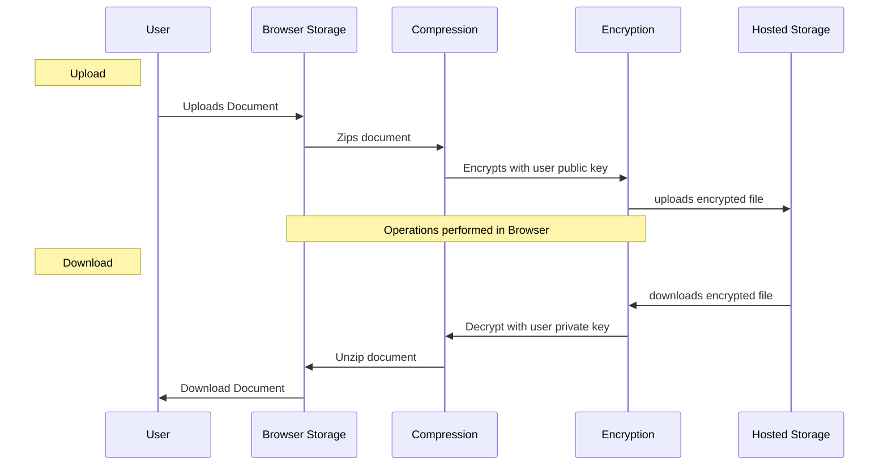
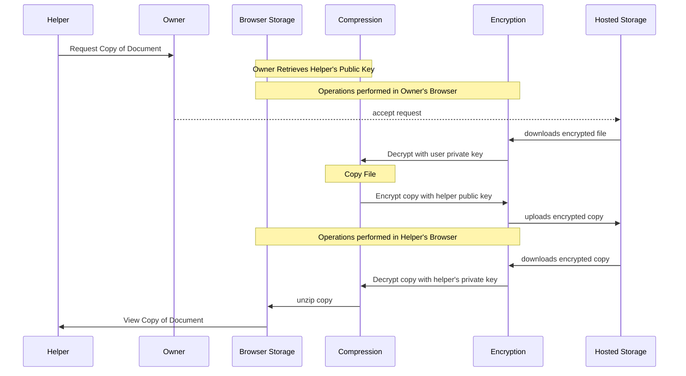

# Document Flow

## Owners uploading and downloading a docucument:
Documents are secured with PGP encrypting. Once a document is uploaded it is encrypted in the browser with the Owner's public key before being uploaded to hosted storage on the server.  Conversly, the when files are downloaded they must be decrypted with the owner's private key before they can be viewed. Importantly, neither the raw file nor the owners private key is ever made available to the server. See the diagram below.

*Note: for purposes of simplicity thumbnail handling was left off the diagram.  In the actual process, each step is performed twice, once on the file, and once on a thumbnail of the file.*

## Sharing a document with a Helper

When sharing a document the a helper, the file must be downloaded from the server, decryted with the owner's private key, copied and encrypted with the helper's public key before being reuploaded to the server.  With this meathod there is an additional copy of the file on the server encrypted with the public key of each share recipiant.  When a shared file is revoked the version of that file encypted with the revoked Helper's public key is deleted from the server.  See the image below for the full document flow:

