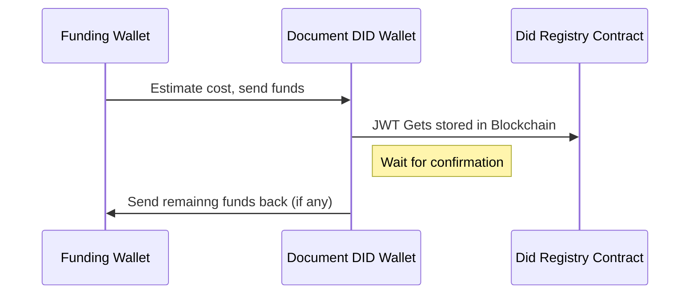

# Blockchain

We mainly use the blockchain to store a JWT of a [verifiable credential](https://en.wikipedia.org/wiki/Verifiable_credentials) in an immutable way and also in a format that a [uniresolver](https://github.com/decentralized-identity/universal-resolver) can access. In this way you can think of it as storing data in a place that CANNOT be changed and a URL is associated with that piece of data so that you can retrieve it conveniently.

## UportClient

This uses the Uport [ethr-did-registry](https://github.com/uport-project/ethr-did-registry) smart contract to post JWTs to the Ethereum Blockchain. To interact with this contract the documents did address needs to be the one publishing a blockchain transaction. There is a problem here in that these newly created document dids do not have any ethereum on it to make a transaction. To solve this problem we use our funding wallet estimate how much the transaction will cost, then send the funds over to the document did address. The document DID makes the transaction with the UPort registry and then sends the remaining funds back to the funding wallet.

Here are all the steps broken down in more detail.

Constants Explanation:
NAME_KEY - this is a special hash of the 'url' which this jwt will live did/svc/vpjwt
CONTRACT_DEFAULT_GAS - How much gas it costs to run the contract. We overestimate here because data can vary slightly
FUND_ACCOUNT_GAS - 21000 is the gas cost to send ethereum around.
NONCE - This is the # of transactions completed on current wallet. This is used for if more transactions are coming in while we have a pending transaction.

Steps:
We add our document did private key to our internal web3 wallet so we can make transactions

Convert the jwt json data into hex

Get the current ethereum gas price using the [EthGasStation](https://ethgasstation.info/) api

Send initial funds from funding account to did document account.

Wait for confirmation

Once the document did account has funds we interact with the [DID Registry Contract](https://github.com/uport-project/ethr-did-registry) to store the data (jwt) on the blockchain

Wait for confirmation

We see if we have enough funds left to send back after covering the cost of gas. If we do we send back remaining funds to the initial funding wallet.

## RskBlockchainClient

[Rootstock](https://developers.rsk.co/) (RSK) is a fully Eth evm compatible sidechain of bitcoin. We take this to our advantage because of high Ethereum fees and show that our process is blockchain agnostic. This does essentially the same thing as the Uport client but we interact with the RSK smart contract in a slightly different way by using the rskapi instead of web3 wallet.

## SimpleBlockchainClient

This is a placeholder class that is used if the app does not detect any private keys in the .env file. This can only create DIDS and verify VCs and VPs but does not have any capability to write to a blockchain.
